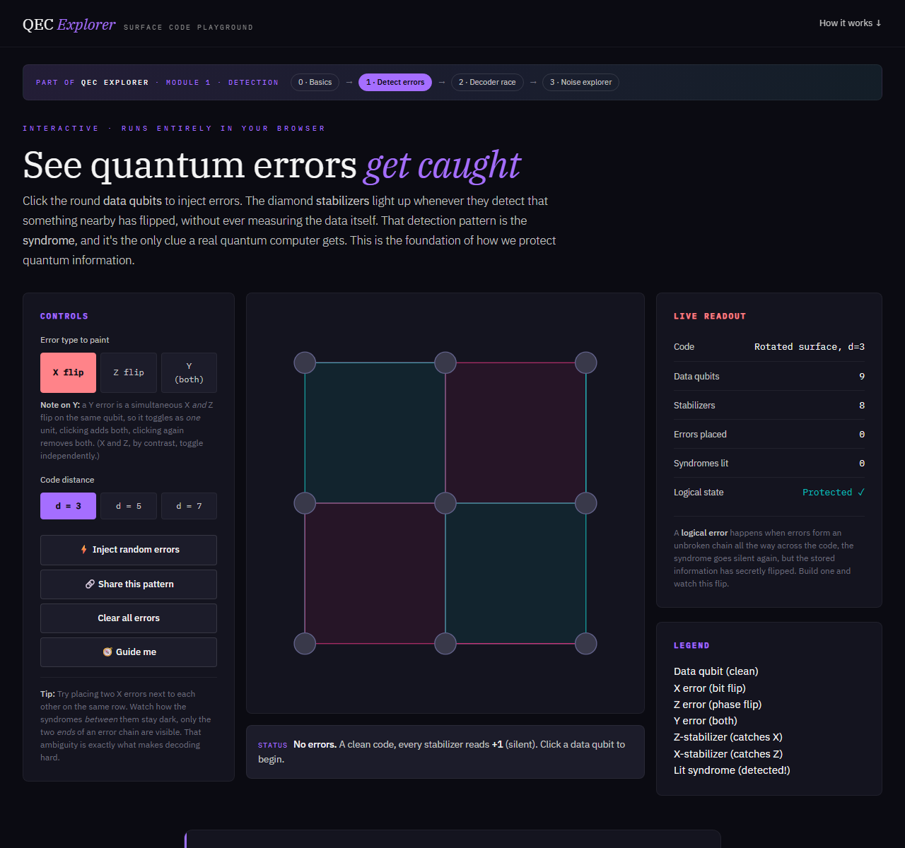

# QEC Explorer

**An open-source, interactive tool for seeing how quantum error correction actually works, in real time, in your browser.**

Click qubits to inject errors on a real rotated surface code, watch the stabilizers light up to detect them, race four real decoders (including research-grade BP-OSD) to fix the damage, run a live Monte Carlo hunt for the error threshold, and step up to the frontier with the real [[144,12,12]] qLDPC gross code. Then rebuild every piece from scratch in plain Python with the companion Colab notebooks.

<p align="center">
  <a href="https://qec-explorer-iota.vercel.app/"><b>▶ Open the live tool</b></a>
  &nbsp;·&nbsp;
  <a href="https://qec-explorer-iota.vercel.app/basics">Start with the basics</a>
  &nbsp;·&nbsp;
  <a href="https://qec-explorer-iota.vercel.app/notebooks">Browse the notebooks</a>
</p>

<p align="center">
  
</p>

<p align="center">
  
  
  
</p>

---

## Why this exists

Most explanations of quantum error correction are either a hand-wavy cartoon or a wall of stabilizer algebra. QEC Explorer sits in between: everything you click is backed by the real physics and the real decoding algorithms, but you never have to install anything or read a paper to start playing. The goal is that a curious high-schooler and a working researcher can both learn something from the same page.

The project has one rule it holds itself to: **be honest.** The lattice is a faithful rotated surface code, the decoders are real implementations, and where the results are messy (a threshold that does not cleanly cross at small distances, a decoder that guesses wrong), the tool says so instead of faking a tidy answer.

## Interactive modules

Everything runs client-side. No accounts, no server, no build step.

| Module | What you do | Status |
|--------|-------------|--------|
| **0 · Basics** | A beginner on-ramp: qubits, superposition, and gates on a 3D Bloch sphere | ✅ Live |
| **1 · Detection** | Inject X / Z / Y errors on a surface code and watch the syndrome fire | ✅ Live |
| **2 · Decoder race** | Four real decoders (lookup, MWPM, belief propagation, and BP-OSD) compete on the same syndrome | ✅ Live |
| **3 · Noise explorer** | A live Monte Carlo over error rate and bias; hunt the threshold yourself | ✅ Live |
| **4 · qLDPC** | The real [[144,12,12]] gross code as a force-directed Tanner graph, plus a live BP-OSD decode lab | ✅ Live |

A plain-English [landing page](https://qec-explorer-iota.vercel.app/) and a [research-connection page](https://qec-explorer-iota.vercel.app/research) tie the whole thing together.

## Companion notebooks

Each notebook rebuilds a piece of the tool from scratch in plain Python, and (where it matters) asserts that its by-hand results match the live JavaScript exactly. Open any of them in Google Colab in one click:

| # | Notebook | Topic |
|---|----------|-------|
| 0 | [Quantum bits from scratch](https://colab.research.google.com/github/kondshk/QEC-Explorer/blob/main/notebook00_quantum_bits_from_scratch.ipynb) | Amplitudes, gates, and measurement, no libraries |
| 1 | [Building the surface code by hand](https://colab.research.google.com/github/kondshk/QEC-Explorer/blob/main/notebook01_surface_code_by_hand.ipynb) | Data qubits, stabilizers, syndromes, proven to match the live tool |
| 2 | [Decoding by hand](https://colab.research.google.com/github/kondshk/QEC-Explorer/blob/main/notebook02_decoding_by_hand.ipynb) | Lookup, MWPM, and BP decoders, verified against `decoders.js` |
| 3 | [Noise, Monte Carlo, and the threshold](https://colab.research.google.com/github/kondshk/QEC-Explorer/blob/main/notebook03_noise_and_threshold.ipynb) | The experiment behind Module 3, with an honest look at what d = 3 to 7 can show |
| 4 | [Beyond the surface code: qLDPC](https://colab.research.google.com/github/kondshk/QEC-Explorer/blob/main/notebook04_qldpc_bivariate_bicycle.ipynb) | Bivariate-bicycle codes and the qubit-overhead problem (conceptual) |
| 5 | [Learned decoding with a GNN](https://colab.research.google.com/github/kondshk/QEC-Explorer/blob/main/notebook05_gnn_decoding.ipynb) | A real PyTorch graph-neural-network decoder, trained and benchmarked honestly |

## The physics is real

The lattice connectivity, stabilizer construction, and syndrome parity are physically faithful to the rotated surface code, not a cartoon. The core physics lives in a single shared file (`lattice-core.js`) that every page and the test suite import, and it is checked against the defining invariants:

- Correct qubit and stabilizer counts (d² data qubits, d² - 1 stabilizers) at every distance
- Every pair of stabilizers commutes (the formal definition of a valid CSS quantum code)
- Logical operators (a spanning column of X, or row of Z) correctly produce a silent syndrome

You can run those checks yourself: open `tests/test-runner.html` in a browser and the full suite runs on load.

## The frontier: qLDPC and the gross code

Module 4 steps off the grid. It builds the real **[[144,12,12]] bivariate-bicycle "gross code"** (Bravyi et al., *Nature* 627, 2024) live in the browser from its defining polynomials `A = x³ + y + y²`, `B = y³ + x + x²`, and draws it as a **force-directed Tanner graph**, the way its decoder actually sees it. Because the code is not planar, its stabilizers reach across the whole code; hovering any check lights up the six data qubits it measures, wherever they land, which is exactly the long-range structure a flat grid cannot show.

A second tab is a **live decode lab**: inject Pauli errors, watch the exact syndrome, and run a real **BP-OSD** decoder (`qldpc-core.js`). It always returns the code to the codespace, and when a heavy error slips a logical operator through, the lab says so rather than faking a success. The construction and the decoder are both checked in `tests/qldpc.test.js`:

- 144 physical qubits, 72 + 72 weight-6 checks, every qubit in 3 X-checks and 3 Z-checks
- `Hx · Hzᵀ = 0` (a valid CSS code) and `k = 144 − 66 − 66 = 12` logical qubits
- BP-OSD corrects every single-qubit error exactly and never leaves the codespace, and its OSD-0 solve satisfies `H · e = syndrome` over GF(2)

## Export and import your work

Every interactive module can export what you built, and Module 2 can import too:

- **Modules 1 and 2** export a runnable **OpenQASM 3** circuit (your injected errors, the syndrome-extraction round, and each decoder's proposed correction) that drops straight into `QuantumCircuit.from_qasm3_str(...)`.
- **Module 2** also **imports a Pauli string** (a Qiskit-style `Pauli` label such as `IXIIZIIIY`, or a sparse form like `X0 Z4 Y8`) so you can paste an error straight from a `SparsePauliOp` and watch all four decoders take it on.
- **Module 3** exports a parameterised **Qiskit / Aer** Python template that reproduces your noise experiment.

## For instructors

`worksheet.html` generates a **printable classroom worksheet**: a seeded set of surface-code decoding puzzles, each asking whether the decoder fixes the error or lets one through, with an answer key on the last page. Every answer is computed by the same real `evaluateCorrection` as the interactive tool, and the whole sheet is deterministic from its seed (so every student gets the identical set). Set the options and print to PDF, or deep-link a specific sheet with `worksheet.html?n=8&d=mix&seed=your-seed`.

## Run it locally

No install, no build step. Either:

```bash
# just open it
open index.html          # macOS
start index.html         # Windows

# or serve the folder (needed for the clean-URL links to resolve)
python -m http.server 8000
# then visit http://localhost:8000
```

The production site is deployed on [Vercel](https://vercel.com) as a plain static site (no framework, no build), which is what gives the clean extensionless URLs.

## Repository layout

```
index.html          Module 1, surface-code detection playground
basics.html         Module 0, beginner on-ramp with a 3D Bloch sphere
decoder.html        Module 2, the four-decoder race
noise.html          Module 3, Monte Carlo noise and threshold explorer
qldpc.html          Module 4, the [[144,12,12]] gross code and BP-OSD decode lab
research.html       How the toy connects to real QEC research
notebooks.html      Gallery linking every companion notebook
puzzle.html         A deterministic daily decoding puzzle
worksheet.html      Printable, seeded classroom worksheet with answer key
landing.html        Plain-English front door

lattice-core.js     Single source of truth for the surface-code physics
decoders.js         Lookup, MWPM, belief-propagation, and BP-OSD decoders
qldpc-core.js       The gross-code construction, syndrome, and BP-OSD decoder
assets/             Shared theme, the Bloch-sphere engine, the OpenQASM emitter
notebook0*.ipynb    Six companion Colab notebooks
tests/              Browser-based unit tests (open tests/test-runner.html)
```

## Contributing

Contributions of all sizes are welcome, from typo fixes to a new decoder or a new module. See [CONTRIBUTING.md](CONTRIBUTING.md) for how the project is structured and what to keep in mind (the short version: keep the physics honest and the pages dependency-free).

## License

MIT, see [LICENSE](LICENSE).
